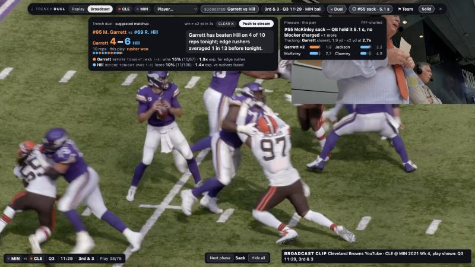
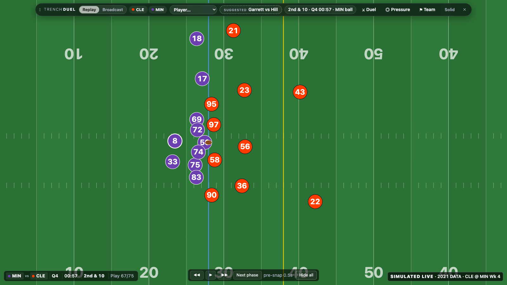
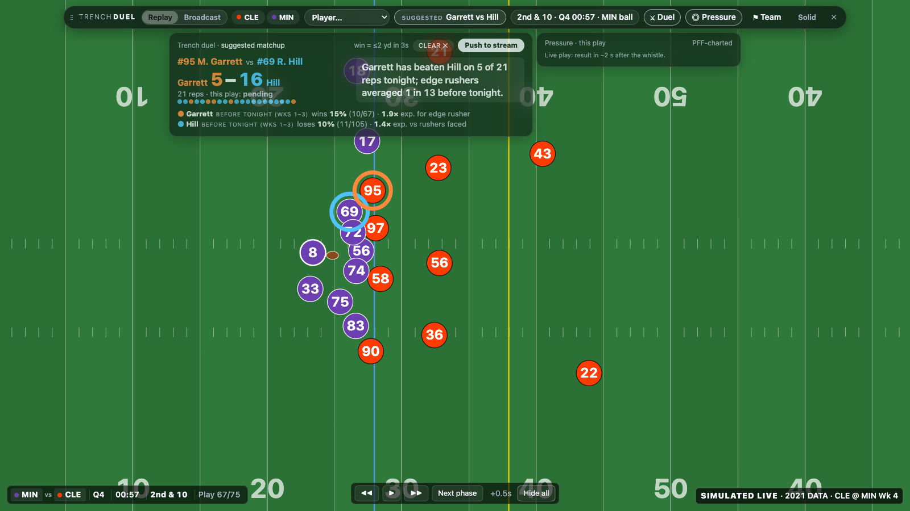
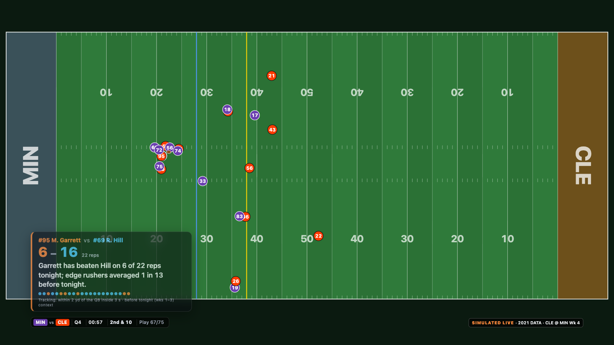
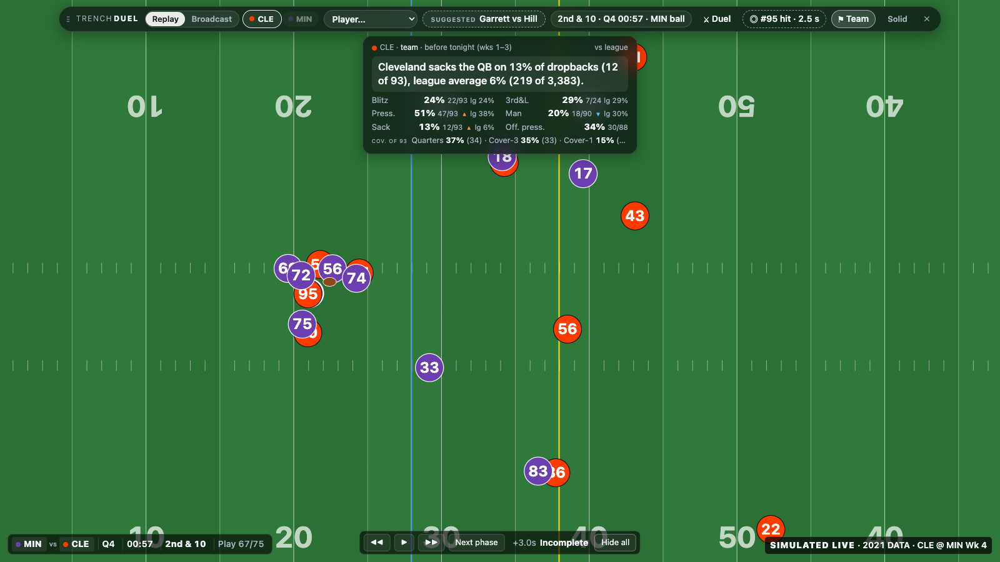
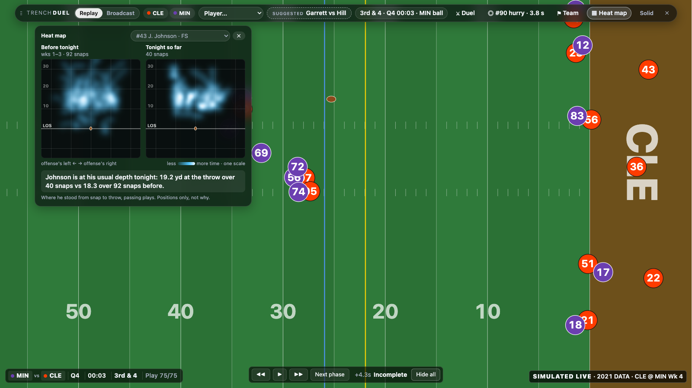

# Trench Duel: a co-streamer overlay for the battle in the trenches

**Trench Duel** is a live overlay that lets NFL co-streamers, popular streamers such as Tom Grossi on YT to stream/broadcast while providing his own original commentary to his fanbase while showing the battle in the trenches: every pass rusher against the lineman blocking him, scored rep by rep as the game unfolds. Streamers get a private control desk that fills in each matchup, its context and a ready-to-say line the moment the tracking data lands, so they stay on the game and choose exactly which story their viewers see and when. Viewers see only what the streamer pushes, landing between plays instead of over them, like "Garrett has beaten Hill on 6 of 29 reps tonight." It turns the hardest part of football to see into a storyline casual fans can follow and regulars can argue over, giving each stream's community something to rally around between snaps. For the NFL, it makes creator co-streams a place where fans learn the game while they're entertained, using the league's own tracking data to bring new audiences in through the voices they already trust.

## How it works, in pictures

**1. A livestream with the streamer's private controller on top.** The game plays full screen; the streamer's bar and cards float over the top edge.



**2. Before the snap: everything collapsed.** One bar shows the situation, the offense's look and the defense's blitz tendency, plus a suggested matchup to watch.



**3. During the play: nothing is spoiled.** The duel reads "pending" until the tracking data can know the result.



**4. After the play: the result and the story.** Garrett has beaten Hill on 6 of 22 reps, with a ready-to-say line, the context from earlier weeks and the pressure story.


**5. What viewers see: only what the streamer pushes.** One click on "Push to stream" puts the duel card on the viewer screen; it clears at the next snap.



**6. Team tendencies, with a count beside every percentage.**



**7. Where a player is lining up tonight vs before.** The **Heat map** button in the bar opens a panel on the left: a player's positions from snap to throw, sack or scramble before tonight (weeks 1–3) beside tonight so far, on one colour scale. `#heat=1` opens it and `#heatPlayer=<id>` picks the player. Below, the same map from `heatmaps.py`, with tonight split by half.



## Run it

```bash
python3 -m venv .venv && .venv/bin/pip install pandas numpy matplotlib
.venv/bin/python trench_duels.py            # about 15 s; writes output/ and overlay/data/demo_game.js
.venv/bin/python heatmaps.py --overlay      # regenerates overlay/data/heat.js, the Heat map panel's weeks 1–3 maps
open overlay/index.html                     # the co-streamer overlay over a replay of CLE @ MIN
python3 -m http.server 8000 -d overlay      # Broadcast mode (YouTube clip) needs http: open http://localhost:8000
.venv/bin/python heatmaps.py                # coverage heat map: John Johnson III tonight vs weeks 1–3 (--player, --game)
```

In the overlay, `Tab` shows or hides the bar, `H` or `Esc` hides everything, and `←` `→` `space` step through plays. Drag the bar by its handle to a snap point (top-left, top-centre, top-right); `Solid` swaps the tinted bar for an opaque one. Pills start collapsed; the "Suggested" chip opens the game's most-met matchup. ▲ and ▼ mark above or below the league average, not good or bad.

The **Heat map** button opens a panel on the left: where a player stood from the snap to the throw or sack, before tonight (weeks 1–3, from `overlay/data/heat.js`) beside tonight so far, on one colour scale, with one sentence comparing his depth at the throw. Tonight counts only plays already shown, and the play on screen joins once its tracking has arrived. The map follows the player picked in the bar or on the field; with nobody picked it shows John Johnson III when Cleveland defends and the defense's first safety otherwise, and the panel's own menu switches player. `#play=75&phase=after&heat=1` opens it at the end of the game; `&heatPlayer=44903` picks the player.

`http://localhost:8000/` is the streamer's controller and has everything. `http://localhost:8000/viewer.html` is what viewers see, and what OBS would capture: the game plus only what the controller pushes. In the Duel pill, "Push to stream" puts the Duel card on the viewer page and shows "ON AIR: Garrett vs Hill" in the controller's bar; clicking again pulls it, `H` pulls it too, and it clears by itself at the next snap. `viewer.html#demo=push&play=67&phase=after` renders the pushed card on its own.

The game plays back as a simulated live feed, labelled "SIMULATED LIVE · 2021 DATA · CLE @ MIN Wk 4". Each play runs pre-snap, live, then after-play: the bar shows the situation, the offense's look and the defense's blitz tendency before the snap. Tracking data reaches the overlay about 2 seconds after it happens, as a real feed would, so the controller shows each Duel result as soon as the data could know it: when the ball is thrown or the 3-second window closes, plus that latency, even mid-play. The PFF-based results (ball-out time, rushers vs blockers, the PFF-charted pressure story) arrive about 2 seconds after the play. Viewers see only what the streamer pushes: Push is disabled during live action, and a pushed card clears at the snap. The Duel season line and the Team pill use weeks 1–3 only, the games before this Week 4 game. Opening `http://localhost:8000/#play=67&phase=after&duel=1&pressure=1` shows the moment in the screenshot; `#play=67&frame=10&duel=1` shows the same play while live, with the tally at 5 of 21 and this rep pending because the data can't know it yet; `#play=75&phase=after&duel=1` shows the final tally, 6 of 29; `#bg=video&duel=1&pressure=1` opens the Broadcast clip of play 38 before the snap, and pressing `N` (or "Next phase") twice reveals the after-play result once the sack has played.

## What is in the box

| File | What it is |
|---|---|
| `trench_duels.py` | The pipeline: builds every rep from PFF's who-blocked-whom labels and the tracking data, validates it and writes the outputs |
| `output/reps.csv` | 44,045 blocker–rusher reps across 122 games: blocker, rusher, closest distance to the QB, seconds to pressure, win, expected win |
| `output/season.csv` | Weeks 1–8 per-player totals with wins over expected; a rusher counts once per play (33,107 rusher-plays) |
| `output/teams.csv` | Weeks 1–8 per-team blitz rate, 3rd-down blitz rate, man coverage rate, top coverages, and pressure and sack rates for and against |
| `output/validation.txt` | Agreement with PFF's hand-charted pressures, overall and by alignment and threshold |
| `output/top_rushers.png` | Top rushers over expectation, weeks 1–8 (min 150 rusher-plays) |
| `heatmaps.py`, `output/heatmap_johnson_2021100305.png` | Coverage heat map: a player's position from snap to throw, sack or scramble, stacked on the line of scrimmage, tonight's halves against his earlier weeks. For John Johnson III, tonight matches his usual depth (19.2 yd at the throw, sack or scramble over 40 plays vs 18.3 yd over 92); `--overlay` writes the panel's `overlay/data/heat.js` |
| `output/overlay_screenshot.png`, `output/viewer_screenshot.png` | The streamer's controller and the viewer screen at play 67, Garrett vs Hill |
| `overlay/` | The overlay: a simulated live replay drawn from tracking, or a Broadcast clip of one play, with the draggable top bar (situation, offense look, defense slots), a suggested-matchup chip, Duel, Pressure and Team pills, the Heat map panel (`heat.js`, `heat.css`), a Solid toggle and hide-all; `viewer.html` is the viewer page that shows only what the controller pushes |

## How far to trust it

- **Validation:** when tracking says a rusher won, PFF credited a hit, hurry or sack to him 67% of the time, 5.7× the base rate (unit: rusher-plays). The tracking rule catches 38% of PFF's pressures, because pressure that never gets within 2 yards (a hurry from outside) is not a won rep.
- **Alignment matters.** Interior linemen start closer to the quarterback, and a collapsing pocket can bring them within 2.5 yards without beating anyone. At 2.5 yards only 25.6% of interior "wins" were PFF pressures, about a quarter; at 2 yards it is 58.7% inside and 67.0% on the edge. So the threshold is 2 yards and every player is judged against the average for his alignment (edge 7.7%, interior 4.3% of blocked rusher-plays, from `league.byAlign` in `overlay/data/demo_game.js`; `validation.txt` counts every rusher-play and gives 7.7% and 4.4%).
- **Double teams:** a double-teamed rusher counts once per play; each blocker on him gets the rep.
- **Two time windows:** the analysis, the leaderboard and the chart use weeks 1–8 (Garrett: 39 wins in 191 rusher-plays). The overlay's season line and Team pill use weeks 1–3 only, so nothing comes from after the game (Garrett before Week 4: 10 of 67).
- **Pressure stories are PFF-charted**, and PFF charts after the game. A story names a blocker only when PFF charged him against that rusher, and gives the ball-out time for hits and hurries. 195 of 543 sacks (36%) have no blocker charged, so the story has its own wording for them.
- **Data:** the Big Data Bowl 2023 set covers 2021 weeks 1–8, passing plays only, and tracking stops at the throw or sack. The overlay replays a recorded game and is labelled "SIMULATED LIVE · 2021 DATA"; a live version needs the NFL's licensed real-time feed.
- **Prior work:** ESPN's Pass Rush Win Rate asks the same question with Next Gen Stats (did the rusher beat his block within 2.5 s), STRAIN (Big Data Bowl 2023) measures how fast rushers close on the quarterback, and a 2026 Penn preprint ranks blocker–rusher contests head to head. Creator overlays exist too: since 15 September 2026, FAN.live and Creator Sports Network give creators live NFL renders with overlays and player info built from official data. Neither the overlay idea nor the stat is new. Trench Duel's contribution is the delivery: a spoiler-safe, alignment-adjusted head-to-head tally a commentator can read out, built from public data.

## What's next

- **Push every card, not just the Duel.** The streamer browses in private and sends only what they pick; the prototype already does this for the Duel card. Pushing between plays also keeps stats from running ahead of the video: at Super Bowl LIX, streams ran 26 to 51 seconds behind the live action.
- **Protected areas:** the streamer marks the parts of the screen a card may never cover, such as the ball, the players in the play and the score.
- **A live feed from Genius Sports**, the NFL's exclusive distributor of real-time stats and Next Gen Stats, synced to the stream's delay.
- **Next Gen Stats live models in place of PFF charting**, since PFF charts after the game.
- **The rest of the team's stats spec:** five fixed pills, per-position cards for the QB, pass rusher, lineman and team defense, and layouts that snap into place on their own.
- **OBS integration**, so the overlay drops into the software streamers already use.
