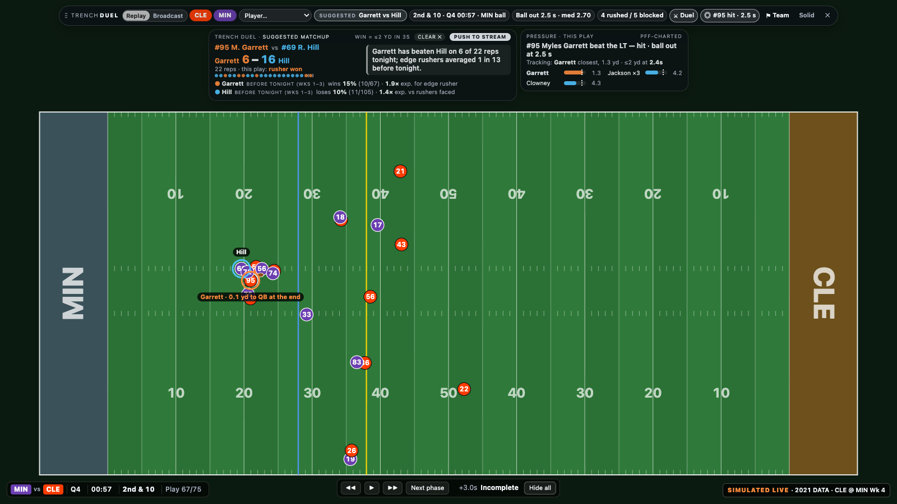
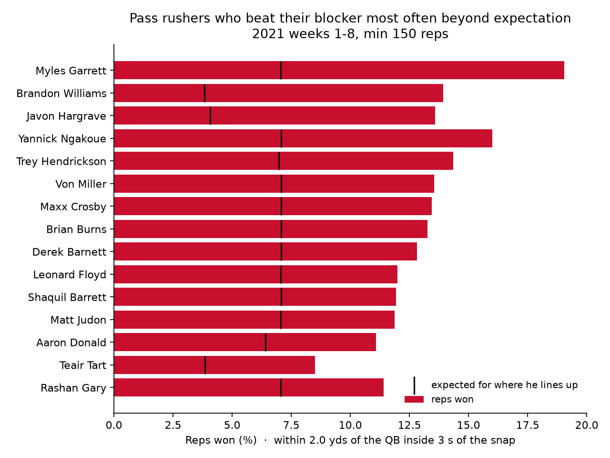

# Trench Duel: a co-streamer overlay for the battle in the trenches

**Trench Duel** turns NFL player-tracking data into a running scorecard of every pass rusher vs offensive lineman matchup: a rusher wins the rep when he gets within 2 yards of the quarterback inside 3 seconds of the snap, judged against the rate expected for where he lines up. It shows how lopsided single matchups get: in Week 4 of 2021, Myles Garrett beat Rashod Hill on 6 of 29 reps, about three times what an edge rusher usually manages, and over weeks 1–8 Garrett leads the league in reps won over expectation. It is built for co-streamers and broadcasters, who get a ready-to-read line ("Garrett has beaten Hill on 6 of 22 reps tonight") in a movable overlay they control and can clear with one key. The tally counts only plays already shown, so it never spoils what viewers haven't seen. A scout or coach can use the same rep table to find which blocker an opponent's best rusher should be matched against.





## Run it

```bash
python3 -m venv .venv && .venv/bin/pip install pandas numpy matplotlib
.venv/bin/python trench_duels.py            # about 30 s; writes output/ and overlay/data/demo_game.js
open overlay/index.html                     # the co-streamer overlay over a replay of CLE @ MIN
```

In the overlay, `Tab` shows or hides the bar, `H` or `Esc` hides everything, and `←` `→` `space` step through plays. Drag the bar by its handle. Opening `overlay/index.html#play=67&frame=33&pressure=1` pauses on the moment in the screenshot.

## What is in the box

| File | What it is |
|---|---|
| `trench_duels.py` | The pipeline: builds every rep from PFF's who-blocked-whom labels and the tracking data, validates it and writes the outputs |
| `output/reps.csv` | 44,045 reps across 122 games: blocker, rusher, closest distance to the QB, seconds to pressure, win, expected win |
| `output/season.csv` | Per-player totals with wins over expected |
| `output/validation.txt` | Agreement with PFF's hand-charted pressures |
| `overlay/` | The overlay: a replay drawn from tracking, with the draggable top bar, duel and pressure pills, and hide-all |

## How far to trust it

- **Validation:** when tracking says a rusher won, PFF charted a hit, hurry or sack on that play 67% of the time, 5.7× the base rate. The tracking rule catches 38% of PFF's pressures, because pressure that never gets within 2 yards (a hurry from outside) is not a won rep.
- **Alignment matters.** Interior linemen start closer to the quarterback, and a collapsing pocket can bring them within 2.5 yards without beating anyone. At 2.5 yards only 22% of interior "wins" were real pressures, so the threshold is 2 yards and every player is judged against the average for his alignment (edge 7.1%, interior 3.8%).
- **Double teams:** when two blockers share a rusher, a win counts against both.
- **Data:** the Big Data Bowl 2023 set covers 2021 weeks 1–8, passing plays only, and tracking stops at the throw or sack. The overlay replays a recorded game and is labelled as a replay; a live version needs the NFL's licensed real-time feed.
- **Prior work:** ESPN's Pass Rush Win Rate asks the same question with Next Gen Stats (did the rusher beat his block within 2.5 s), STRAIN (Big Data Bowl 2023) measures how fast rushers close on the quarterback, and a 2026 Penn preprint ranks blocker–rusher contests head to head. Trench Duel's contribution is the delivery: an alignment-adjusted, spoiler-safe in-game tally a commentator can read out, built from public data.
